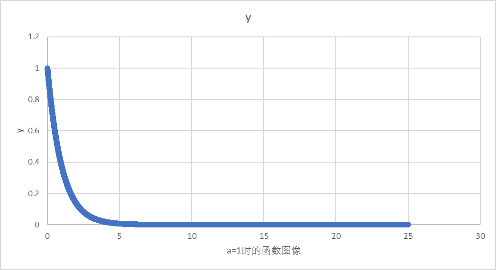

思考题答案
1.最终定态值：0.000998
2.最终定态值：0.000998
3.最终定态值：0.000998
4.该方程最终可化成y=a*e^(-x),无论a取何值，随着x的增大，y会趋向于0.所以一定可以取到最终定态值

代码最初思路：使用欧拉法，首先确定初值，y0=a，x0=0,f(xn,yn)=-y,h=0.001,误差极限error=0.000001
根据欧拉法：y(n+1)=yn+h*f(xn,yn)
定义y(n+1)=y_next
通过循环语句向下迭代计算：通过欧拉法得出y_next,同时更新xn，即x=x+h，之后进行if语句判断，如果y_next-y<error，可将此值视为定态值，终止循环
否则将y_next赋值給y，继续循环，直到循环结束。

存在问题：上述方法可以求得题目要求的定态值，但无法满足下方思考题的要求，打印a=1/π/e时，将所取范围内所有瞬时值打印。

继续改进：我们希望达到这样一个效果，用户可以随意输入一个合适的a值，此时x的范围取[0,25a],将其瞬时值都打印出来并且最后输出一个定态值(该定态值应符合最初题目要求即y前后差值小于0.000001认为其为定态值)。

存在问题：1.若能在x的范围内取到近似定态值，如何使最后打印的定态值成功打印，因为要打印所有瞬时值，所以在取得定态值时循环不能停止，应使其继续打印，可接下来所有x值对应的y值都是符合题目的定态值，且越往后越趋于0，怎样选取合适的定态值是一个需要思考的问题。
         2.若在x的范围内无法取到定态值该如何处理。

解决思路：1.在第一次满足y_next-y<error时将此时的值进行保存，在代码中我们定义一个steady_state_found来储存此时的定态值并且只储存着第一次的定态值，最后可以解决上述第一个问题，将所有瞬时值打印的同时能够打印符合题目的定态值。
          2.经过尝试，可以发现基本所有a值，都可以在x范围内取到最终定态值，若以后出现一个无法取到的 即在x所取得范围内y_next-y<error不成立，我们可以取最接近的一次为最终定态值，因为本题y是衰减的，所以可以取最后一次的y值为定态值，它会最接近定态值

          
          
          图像由VS中代码先抓取数据再在Excel表中完成，代码大致实现如下，因生成图像大致相似，仅放置a=1时的图象。

#include <stdio.h>  
#include <math.h>  
void calculate_and_write_values(double a, double start_x, double end_x, double step, const char* filename) {
    FILE* file = fopen(filename, "w");
    if (file == NULL) {
        perror("无法打开文件");
        return;
    }

    // 写入表头（可选）  
    fprintf(file, "x\ty\n");

    // 计算并写入每个x值对应的y值  
    for (double x = start_x; x <= end_x; x += step) {
        double y = a * exp(-x);
        fprintf(file, "%lf\t%lf\n", x, y);
    }

    fclose(file);
}

int main() {
    // 定义步长  
    double step = 0.001;

    // 计算并写入a为1时的值  
    calculate_and_write_values(1, 0, 25, step, "values_a_1.txt");

    // 计算并写入a为e时的值  
    calculate_and_write_values(2.71828, 0, 25 * 2.71828, step, "values_a_e.txt");

    // 计算并写入a为π时的值  
    calculate_and_write_values(3.14159, 0, 25 * 3.14159, step, "values_a_pi.txt");

    return 0;
}
