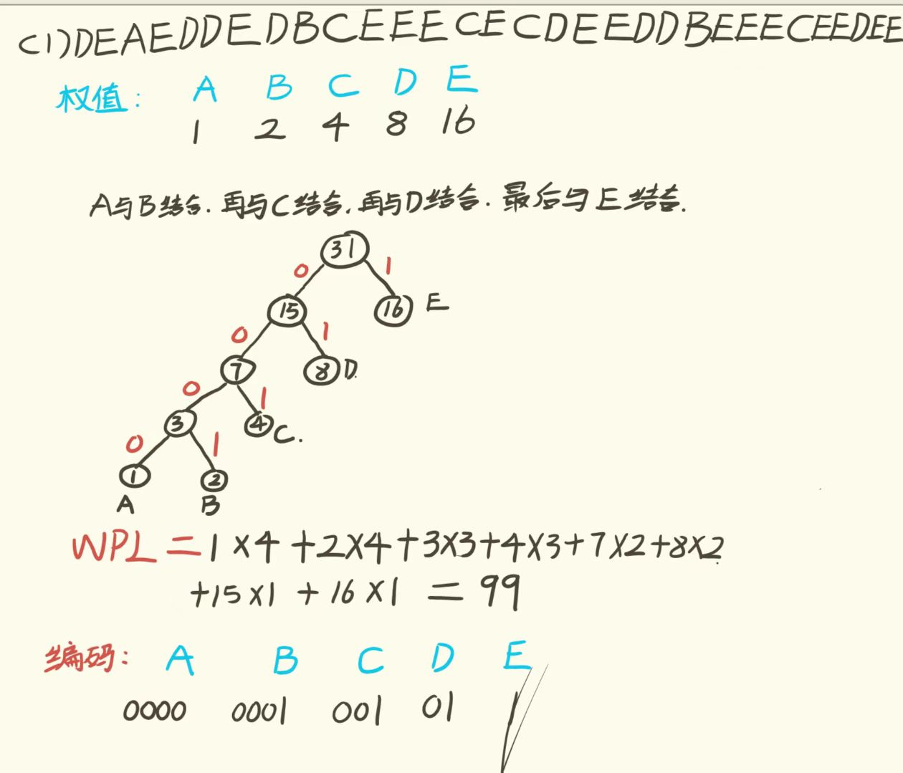
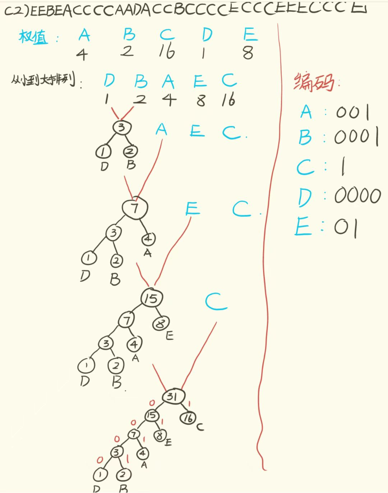

思考题
1：对于哈夫曼树来说，有n个叶节点，说明权值为n，每次选择最小权值的结点合并成新节点，重复运行后，一共会有n-1次合并操作，每次合并都会产生一个新节点，所以会产生n-1个新节点，总共就是2n-1个结点。
2：因为字符在计算机中是以ASCII码的形式存储的，大写字母的是从65到90，小写字母的是从97到122，若想要能够处理小写字母串，则需要在主函数处理输入字符串时，包括小写字母。个人的想法是改进原函数所用的0x41+j的形式，用if（str[i]>='a'&&str[i]<='z')来判断是否为小写字母,>='A'&&<='Z'来判断是否为大写字母，这样既可以处理大写字母，也可以处理小写字母。还有另一个想法，可以设定两个数组，一个存放大写字母，另一个存放小写字母，但这样会增加程序复杂度。
3：

代码填充大致思路：首先实现遍历输入字符串的功能，记录出现了几个字母，每个字母出现的次数，也就是权值，然后开始构建哈夫曼树，以huffman[i][0]表示父节点，huffman[i][1]表示左孩子，huffman[i][2]表示右孩子，huffman[i][3]表示权值。初始化前n个叶节点的权值，这里的权值来自输入字符串中各个大写字母的出现次数。接着通过循环，每次找出两个权重最小的节点进行合并，更新新生成节点以及被合并节点的相关属性信息，直到生成完整的哈夫曼树（共2 * n - 1个节点，其中前n个为叶节点，后n - 1个为中间节点）。findmin函数负责找出权重最小的两个节点，findparent函数通过递归的方式查找给定节点i的父节点，从而得到节点到根节点的路径长度。如果节点i的父节点索引为 -1，说明它是根节点，此时返回路径长度为 0；否则递归地调用自身查找父节点的父节点，并累加路径长度。找到路径长度和权值后便可计算wpl，即带权路径长度。最后，输出哈夫曼树的结构，以及每个字符的huffman编码。huffmancode负责输出编码，从给定的叶节点i开始，通过不断访问其父节点，根据当前节点是父节点的左子树还是右子树，在code数组中相应位置填充0或1，直到到达根节点。然后将code数组中的编码进行反转（因为是从叶节点到根节点生成的编码，需要反转得到从根节点到叶节点的正确编码顺序），最后打印出对应大写字母及其哈夫曼编码。

改进：将最后code数组进行反转时，可以选择用一个中间变量来实现交换，使代码可读性更高。
不足：在中间的findmin函数中，没有给出有两个相同权重的节点的处理方式，在测试时若输入字符串有两个权重相同的字母，可能会出现bug，后续可以进行优化。